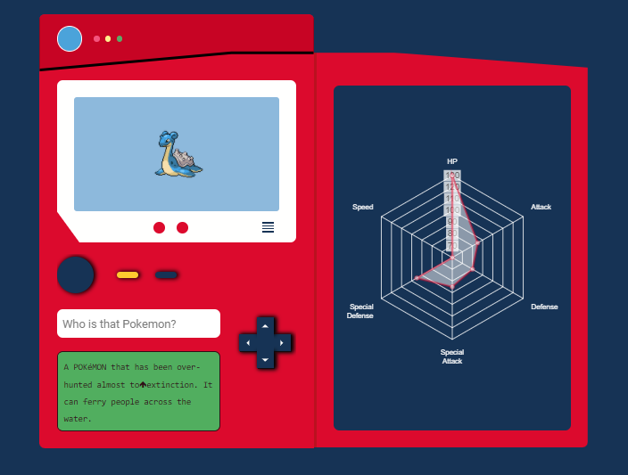

<h1 align="center">Hi 👋, I'm David De la Hoz</h1>
<h3 align="center">I'm a Henry's Full Stack Developer🌟.</h3>

- 🌱 I’m currently learning Web Development and other programming languages

- 📫 How to reach me **dricardelo@gmail.com**

- ⚡ Fun fact :- food and Brandon Sanderson's books are the reasons to live.

## Tech Skills

## 

## Projects

---

### Videogames Library

#### Repository link [here](https://github.com/Daviddlh1/Videogames-library-app)

### Netflix Clone

#### Repository link [here](https://github.com/Daviddlh1/Netflix-clone)

---

#### Deployed ptoject [here](https://netflix-clone-19504.web.app/)

### Pokedex

### Repository link [here](https://github.com/Daviddlh1/Pokedex)

---

### Deployed link [here](https://daviddlh1.github.io/Pokedex/)

# Functions:

- Search pokemons by id(1-898).
- Shows the description reads it out loud.
- Shows a chart of the pokemon's stats.
- Shows different angles and shiny versions clicking on the up and down buttons of the cross.
- Shows the next and previous pokemon clicking on the right and left buttons of the cross.
- Show a random pokemon.

# What did I learn?

- I learned how to use chart.js to build radar charts.
- Practiced my animation skills with CSS.
- I learned how to use logical properties and values.
- Practiced how to consume an API width vanilla JavaScript.
