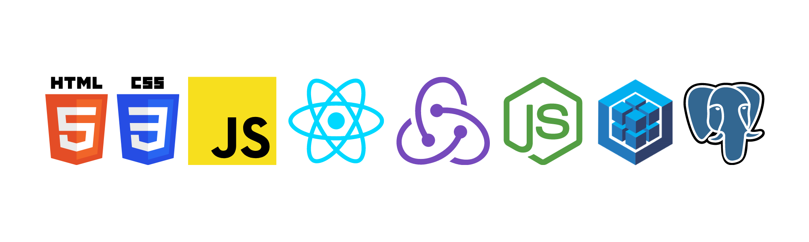

<h1 align="center">Hi 👋, I'm David De la Hoz</h1>
<h3 align="center">I'm a Henry's Full Stack Developer🌟.</h3>

- 🌱 I’m currently learning Web Development and other programming languages

- 📫 How to reach me **dricardelo@gmail.com**

- ⚡ Fun fact :- food and Brandon Sanderson's books are the reasons to live.

 

<h3 align="left">Connect with me:</h3>

  

 

<h3 align="left">Tech Skills:</h3>

 
 ---
  
 ## Projects

